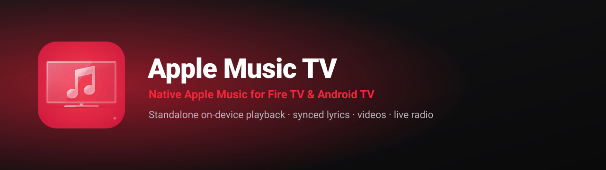
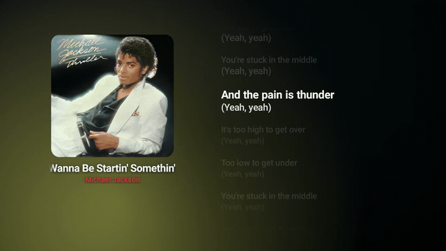
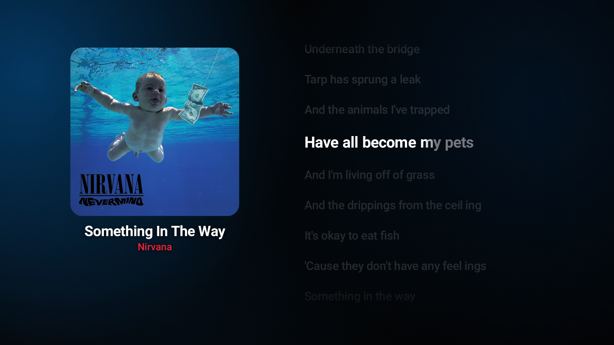
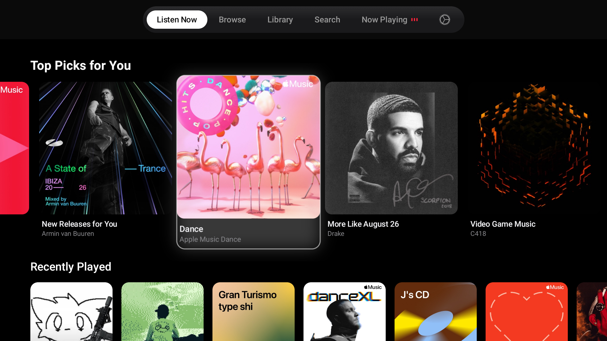
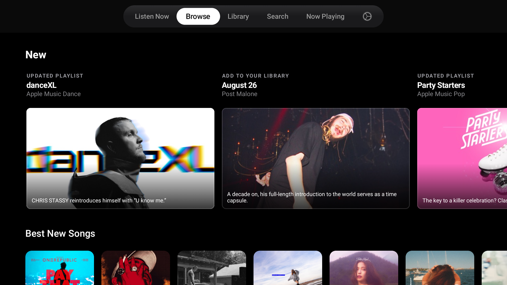
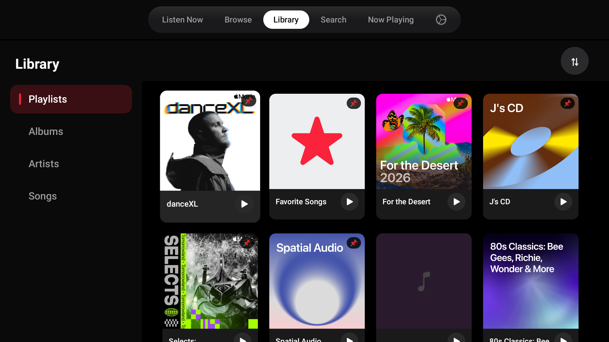
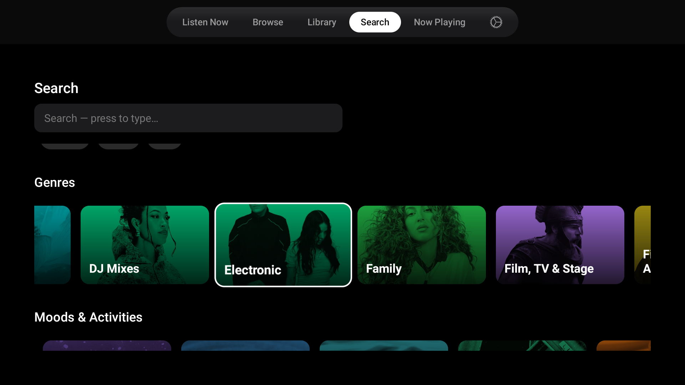
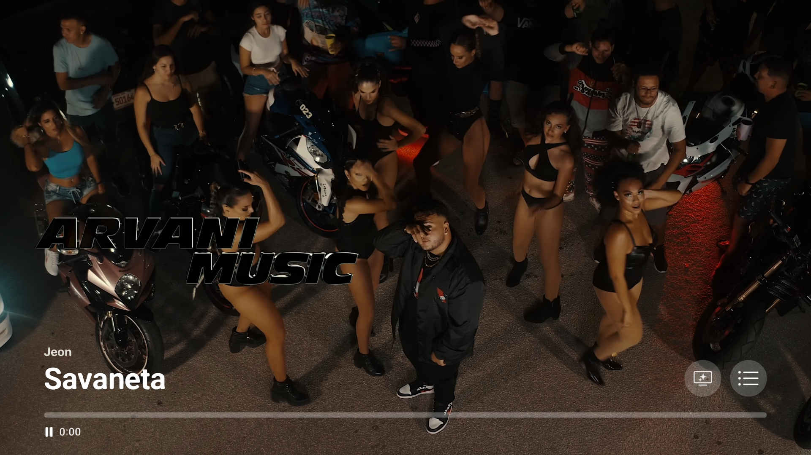
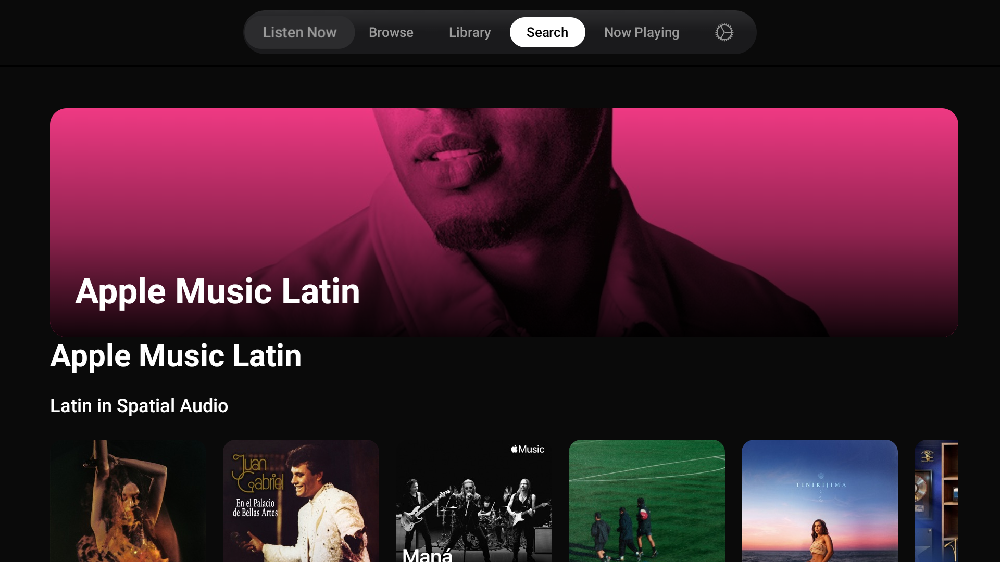

<div align="center">



# Apple Music TV

**A native Apple Music experience for Fire TV, Android TV, and Google TV.**

[](https://github.com/JObersi10/apple-music-tv/releases/download/dev/app-debug.apk)
[](https://github.com/JObersi10/apple-music-tv/releases)

  

<br>



</div>

> Bring your own Apple Music subscription. Streams are decrypted locally for personal playback only. Not affiliated with Apple.

---

## Features

- **Listen Now, Browse, Library, Search** — Apple's real editorial shelves, laid out for a remote.
- **Now Playing** with a live album-colour background and **word-by-word synced lyrics**.
- **Artist pages, playlists, albums** — full catalog navigation.
- **Music videos** and **radio / stations** — all playable.
- **Background playback** and an ambient **screensaver**.
- **Runs standalone on the TV** — a pure-Kotlin Widevine pipeline decrypts each song on-device, no computer required. An optional PC proxy server is also supported.

---

## Screenshots

<div align="center">

**Now Playing — live album-colour background + word-synced lyrics**

[](images/now-playing.png)

</div>

| Listen Now | Browse |
|:---:|:---:|
| [](images/listen-now.png) | [](images/browse.png) |
| **Library** | **Search** |
| [](images/library.png) | [](images/search.png) |
| **Music Video** | **Categories** |
| [](images/music-video.png) | [](images/category.png) |

---

## Installation

1. **Download the APK** — [latest build](https://github.com/JObersi10/apple-music-tv/releases/download/dev/app-debug.apk) or pick one from [Releases](https://github.com/JObersi10/apple-music-tv/releases).
2. **Sideload it** onto your Fire TV / Android TV:
   ```bash
   adb connect <TV_IP>
   adb install -r app-debug.apk
   ```
   (Or use a sideload app like Downloader with the release URL.)
3. **Add your Music-User-Token** — open `http://<TV_IP>:8080` on your phone and paste it in. [How to find your token →](docs/TECHNICAL.md#getting-your-music-user-token)

Standalone mode needs no server. The optional PC proxy path is described in the [technical guide](docs/TECHNICAL.md#optional-pc-proxy-server).

---

## Development

Built with Jetpack Compose for TV, Media3 (ExoPlayer), Hilt, Retrofit/Moshi and Coil. The optional proxy server is a Bun + Hono app wrapping Apple Music's web APIs.

Architecture, the on-device Widevine/CENC pipeline, the auth flow, CI, and build notes live in **[docs/TECHNICAL.md](docs/TECHNICAL.md)**. Deeper dives: [Apple Music API notes](docs/apple-music-api.md) · [MUT flow](docs/mut-flow.md) · [Projector mode](docs/PROJECTOR_MODE_NOTES.md).

See [CONTRIBUTING.md](CONTRIBUTING.md) to build it, [SECURITY.md](SECURITY.md) for token handling, and [ROADMAP.md](ROADMAP.md) for what's planned.

---

## Credits

The Apple Music decryption workflow was adapted from [gamdl](https://github.com/glomatico/gamdl) (MIT) and relies on [pywidevine](https://github.com/devine-dl/pywidevine) (GPL-3.0). The word-synced lyrics implementation was written independently; [Spicy Lyrics](https://github.com/Spikerko/spicy-lyrics) was a reference for the concept of dynamic word-synchronized lyrics.

Full attribution for every third-party component is in **[THIRD_PARTY_NOTICES.md](THIRD_PARTY_NOTICES.md)**.

## License

Licensed under **[GPL-3.0](LICENSE)**. Third-party components retain their own licenses (see [THIRD_PARTY_NOTICES.md](THIRD_PARTY_NOTICES.md)).

## Disclaimer

For personal and educational use. Apple Music, its content, and its trademarks belong to Apple. This project is not affiliated with, or endorsed by, Apple.
